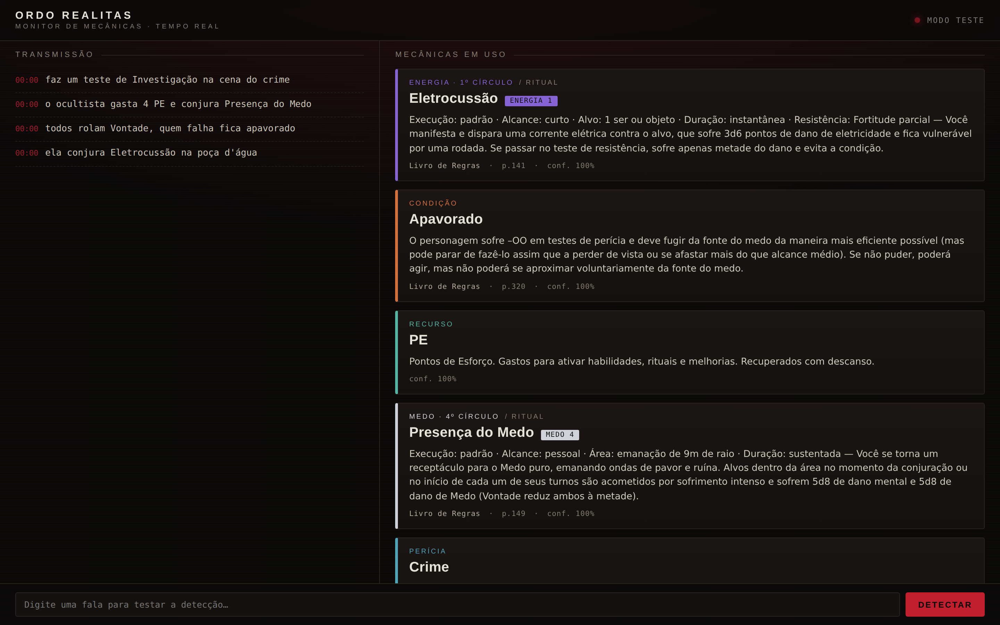
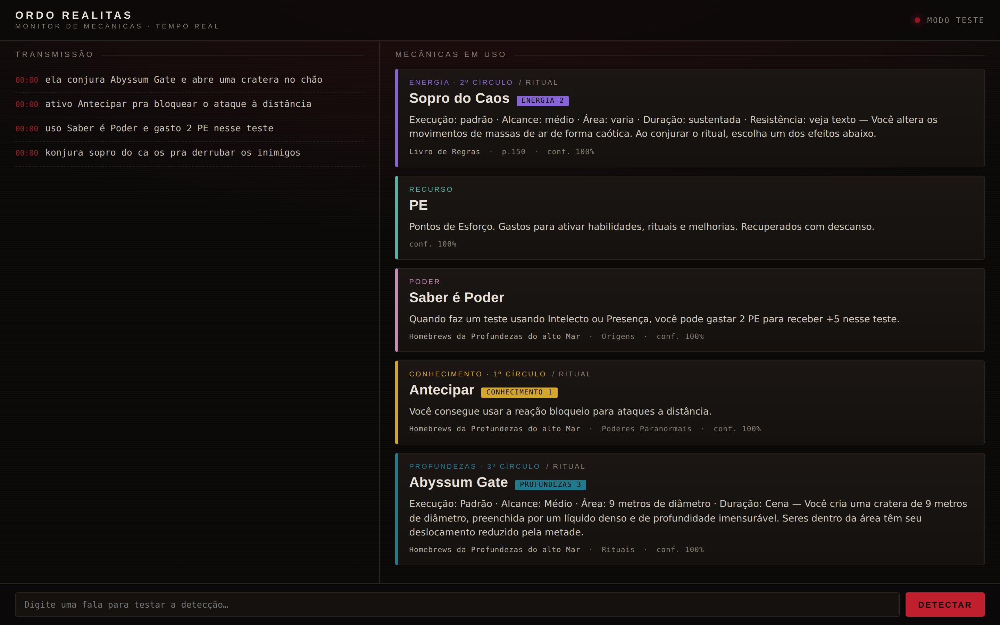
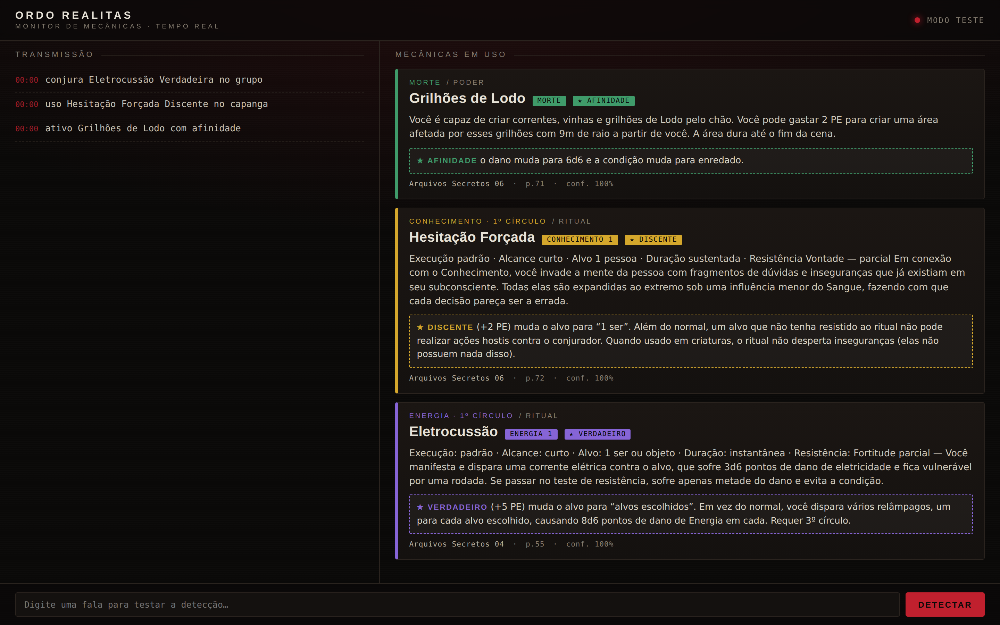

# Ordem Paranormal — Detector de Mecânicas em Tempo Real


Sistema **100% local** que, a partir dos livros e PDFs de Ordem Paranormal,
reconhece na fala da mesa *quais mecânicas estão sendo usadas* (perícias,
rituais, condições, recursos) e mostra a regra e a página de referência.

<p align="center">
  
  <br>
  <sub>Painel "Ordo Realitas": transcricao a esquerda, cards de mecanica a direita, com resumo da regra e referencia de livro/pagina.</sub>
</p>

<p align="center">
  
  <br>
  <sub>Conteudo homebrew de campanha, com elemento customizado, poder paranormal e poder de ficha, incluindo deteccao com fala distorcida.</sub>
</p>

> **Aviso legal:** este repositório contém apenas **código**. Os livros de
> Ordem Paranormal são material com direitos autorais e **não são (nem devem
> ser) versionados aqui** — cada pessoa ingere seus próprios PDFs localmente
> com `ingest.py`. O `.gitignore` já bloqueia `*.pdf` e `*.db`.

Este repositório está **completo nas três fases** — ingestão, voz e web —
todas funcionais e testadas. Roda inteiramente na sua máquina.

---

## O que já funciona

1. **Ingestão** de PDFs, TXT e **DOCX** → limpa marca d'água, junta palavras
   quebradas por hífen, divide em chunks com página/seção. Para `.docx`,
   as seções reais do Word (estilos Título/Heading) viram os "capítulos"
   da fonte — úteis como referência quando não há paginação real.
2. **Léxico automático** de mecânicas:
   - **Rituais** extraídos dos livros pelo padrão `Nome / ELEMENTO Círculo`
     (ex.: *Sopro do Caos — Energia 2*), com página ou seção.
   - **Poderes Paranormais** — mesma estrutura de campos dos rituais, mas
     reconhecidos como categoria própria quando a seção da fonte indica
     "Poderes" (em vez de "Rituais").
   - **Poderes** (formato `[Nome] - descrição`, comum em fichas/homebrew).
   - **Perícias, condições, recursos e atributos** canônicos do sistema.
   - Suporta **elementos homebrew customizados** além dos 5 oficiais
     (Sangue, Morte, Conhecimento, Energia, Medo) — ex.: um 6º elemento
     "Profundezas" de uma campanha de tema marítimo.
3. **Busca full-text** (SQLite FTS5, sem acento) para trazer o texto da regra.
4. **Detector** que recebe uma frase (a fala transcrita) e casa, com
   tolerância a erros de transcrição (fuzzy + fonética pt-BR), contra o
   léxico — devolvendo a mecânica, categoria, elemento/círculo e a
   referência (livro + página, ou fonte + seção).

### Números da ingestão atual
- 9 fontes (8 PDF — Livro de Regras, Sobrevivendo ao Horror e 6 pacotes de
  **Arquivos Secretos** — + 1 DOCX homebrew) · 1554 chunks · **238 termos**
- **103 rituais**, 62 poderes, 35 condições, 27 perícias, 6 recursos, 5 atributos

---

## Instalação

```bash
pip install -r requirements.txt
```

> **Nota sobre o banco (`ordem.db`)**: ele é derivado dos livros e **não é
> versionado** no Git (os PDFs/DOCX têm direitos autorais). Ao clonar o
> repositório, gere o seu banco localmente com `python ingest.py` apontando
> para os seus arquivos — veja abaixo. O `.gitignore` já exclui livros
> (`*.pdf`, `*.docx`) e o banco (`*.db`).

## Uso

**Ingerir fontes** (aceita arquivos ou pastas; rode de novo para adicionar mais):

```bash
python ingest.py "Livro_de_Regras.pdf" "Sobrevivendo_ao_Horror.pdf" homebrew.docx
python ingest.py minha_pasta_de_livros/        # ingere tudo da pasta (pdf/txt/docx)
python ingest.py --force livro.pdf              # reprocessa uma fonte
```

**Detectar mecânicas numa frase** (simula o que a voz vai enviar):

```bash
python query.py "o ocultista gasta 4 PE e conjura Presença do Medo, todos rolam Vontade ou ficam apavorados"
```

Saída:
```
● RITUAL    Presença do Medo [Medo 4]  (100%) — Livro de Regras p.149
    ↳ Você se torna um receptáculo para o Medo puro, emanando ondas de pavor...
● PERICIA   Vontade  (100%) — Livro de Regras p.20
● RECURSO   PE  (100%)
● CONDICAO  Apavorado  (94.7%) — Livro de Regras p.55
```

**Busca livre no texto das regras:**

```bash
python query.py --search "exposição paranormal"
```

**Ouvir a mesa ao vivo (Fase 2 — voz):**

```bash
python listen.py --list-mics             # lista dispositivos; marca [LOOPBACK]
python listen.py --mic                    # só o seu microfone
python listen.py --auto-io                # auto: microfone + loopback (se houver)
python listen.py --devices 1 5            # microfone + loopback (mesa inteira)
python listen.py --wav sessao.wav         # testar com uma gravação primeiro
python listen.py --mic --model medium --device cuda   # modelo maior em GPU
```

### Ouvindo o que você fala E o que você escuta

Numa mesa online, metade da conversa sai do seu fone (os outros jogadores
no Discord) — o microfone sozinho não pega isso. A solução é mixar dois
dispositivos com `--devices <mic> <loopback>`, onde o *loopback* é um
dispositivo de entrada que espelha a saída do sistema:

- **Linux (PulseAudio/PipeWire)**: já existe pronto — é o dispositivo
  `Monitor of ...` que aparece no `--list-mics` marcado como `[LOOPBACK]`.
- **Windows**: habilite o "Stereo Mix" (Painel de Som → Gravação →
  dispositivos desativados) ou instale o VB-Cable e aponte a saída do
  Discord pra ele.
- **macOS**: instale o BlackHole e crie um Multi-Output Device.

O mixer soma os dois fluxos (com reamostragem e proteção contra clipping)
antes do VAD, então falas suas e dos outros entram no mesmo pipeline.
O mesmo vale para o painel web: `python server.py --devices 1 5`.

### Melhorando a qualidade da transcrição

O sistema já aplica três melhorias automáticas: **viés de vocabulário**
(o léxico do banco — rituais, perícias, NEX... — é injetado no Whisper via
`initial_prompt`/`hotwords`, então ele passa a reconhecer os termos do
jogo), **normalização de volume** por fala (áudio fraco do mix é
amplificado antes de transcrever) e **folga de silêncio maior** no VAD
(padrão 550 ms, falas menos picotadas).

Se ainda houver muitos erros, nesta ordem de impacto:

1. **Modelo maior** — `small` (padrão) erra bem mais que `medium`:
   `python listen.py --devices 1 5 --model medium` (CPU aguenta, mais
   lento) ou, com GPU NVIDIA, `--model large-v3 --device cuda --compute
   float16` (melhor qualidade possível).
2. **Falas cortadas no meio** → aumente a folga: `--padding-ms 800`.
3. **Ruído de fundo disparando o VAD** → `--aggressiveness 3`; o inverso
   (falas engolidas) → `--aggressiveness 1`.
4. **Volume do loopback** muito acima da sua voz (ou vice-versa) → ajuste
   o volume relativo no sistema; o mix respeita os níveis de cada fonte.

Lembre que o detector tolera transcrição imperfeita (fuzzy + fonética),
então mesmo com texto meio errado as mecânicas costumam ser reconhecidas —
o modelo maior melhora principalmente a *leitura* da transcrição.

Na 1ª execução o modelo do Whisper (`small` por padrão) é baixado
automaticamente e fica em cache — depois roda **offline**. Cada fala é
segmentada por VAD, transcrita e analisada; as mecânicas aparecem no
terminal com cor por categoria e a página do livro.

Dica: teste com `--wav` de um trecho gravado antes de depender do microfone
ao vivo — o pipeline é o mesmo.

**Página web ao vivo (Fase 3):**

```bash
python server.py --mic                 # ouve o microfone e transmite pra web
python server.py --auto-io             # auto: microfone + loopback (se houver)
python server.py --wav sessao.wav      # processa uma gravação
python server.py --demo                # sem áudio: só o painel + teste por texto
python server.py --demo --reload       # hot reload no navegador/servidor durante desenvolvimento
```

Abra **http://localhost:8000**. A página mostra, lado a lado, a transmissão
(transcrição rolando com timestamp) e os **cards de mecânica** — cada um
codificado pela cor do elemento do ritual (Sangue, Morte, Conhecimento,
Energia, Medo) ou pela categoria, com o **resumo da regra** e a página do
livro.

No **Codespaces**, use host aberto para forwarding de porta:

```bash
python server.py --auto-io --host 0.0.0.0
```

Se o ambiente nao expuser dispositivos de audio (comum em Codespaces web),
use `--demo` ou `--wav`.

No rodapé há um campo de texto: digite uma fala e veja a detecção na hora
(útil para testar sem microfone, ou para o mestre lançar mecânicas manualmente).

---

## Estrutura

```
ordem/
  extract.py   extração + limpeza (PDF/TXT), normalização de termos
  chunk.py     divisão em chunks com página/seção
  lexicon.py   extração de rituais + termos canônicos do sistema
  db.py        SQLite + FTS5: schema, ingestão, busca, contexto
  detect.py    detecção fuzzy de mecânicas na fala (tempo real)
  audio.py     captura (microfone/WAV) + segmentação por VAD
  stt.py       transcrição local com faster-whisper
  pipeline.py  orquestração áudio → STT → detecção (Event)
ingest.py      CLI de ingestão
query.py       CLI de detecção/busca (sem áudio)
listen.py      CLI de escuta ao vivo (microfone ou WAV)
server.py      servidor web (FastAPI + WebSocket)
web/index.html painel ao vivo (transmissão + cards de mecânica)
```

O banco (`ordem.db`) guarda `sources`, `chunks`, `chunks_fts` e `lexicon`.
Dedup por SHA-256 evita reingerir o mesmo arquivo.

---

## Arquitetura completa (tempo real, tudo local)

```
🎤 microfone ─► VAD (webrtcvad) ─► faster-whisper (STT pt-BR)
                                        │ trecho de fala transcrito
                                        ▼
                              detect.Detector  ◄── lexicon (ordem.db)
                                        │ mecânicas reconhecidas
                                        ▼
                        FastAPI + WebSocket ──► 🌐 página web
                                                 (transcrição ao vivo +
                                                  cards de mecânica com
                                                  regra e página do livro)
```

O núcleo (ingestão + `Detector`) e a voz já estão prontos. Falta plugar:

### Fase 2 — Voz ✅ (pronta)
- `faster-whisper` (modelo `small`/`medium`, roda offline após 1º download)
  transcreve em blocos curtos.
- `sounddevice` + `webrtcvad` capturam o microfone e cortam silêncio.
- Cada trecho transcrito passa por `Detector.detect()`.
- CLI: `python listen.py --mic` (ou `--wav` para testar com gravação).

### Fase 3 — Web ✅ (pronta)
- `FastAPI` + WebSocket empurram transcrição + detecções ao navegador,
  reutilizando `ordem/pipeline.py` (que já emite `Event` em JSON).
- Painel mostra a transmissão ao vivo e cards de mecânica codificados por
  elemento, com o resumo da regra e a referência de página.
- Endpoint `/simulate` e campo de texto permitem testar sem áudio.

---

## Resumos de regras
Cada mecânica detectada traz um resumo curto da regra:
- **Rituais**: Execução/Alcance/Duração + as primeiras frases do efeito,
  extraídos direto do livro.
- **Versões e combos (Discente / Verdadeiro / Afinidade)**: os
  aprimoramentos de cada ritual/poder são extraídos junto com o bloco.
  Quando a versão é **falada na mesa** — "conjura *Eletrocussão
  Verdadeira*", "*Hesitação Forçada Discente*", "*Grilhões de Lodo com
  afinidade*" — o card mostra, além da regra base, o texto e o custo da
  versão usada (badge ★ no painel). 113 entradas do léxico têm
  aprimoramentos capturados.
- **Condições**: descrição do apêndice de condições.
- **Poderes** (homebrew): extraídos de fichas/documentos no formato
  `[Nome do Poder] - descrição`; **Poderes Paranormais** também no formato
  dos Arquivos Secretos (`Nome` + `PODER PARANORMAL <ELEMENTO>`).
- **Perícias, recursos, atributos**: resumo curado, estável.

<p align="center">
  
  <br>
  <sub>Versoes faladas na mesa (Discente, Verdadeiro e Afinidade) destacadas no card com badge e resumo especifico.</sub>
</p>

## Testes
Duas formas de rodar:

```bash
python -m pytest tests/ -v          # suíte pytest (a mesma do CI)
python tests/test_detection.py      # runner colorido no terminal
```

A suíte cobre: rituais dos 5 elementos oficiais + o homebrew "Profundezas",
conteúdo dos 6 pacotes de **Arquivos Secretos**, perícias, condições,
recursos, poderes (colchetes e Poderes Paranormais), a mixagem de áudio
(mic + loopback), robustez a ruído de STT (acentos, erros fonéticos,
**palavras partidas** e **distorção pesada**), casos negativos difíceis e
cobertura de todos os 103 rituais (este último só roda se `ordem.db` existir).

**CI**: o workflow em `.github/workflows/ci.yml` roda pytest (Python 3.11 e
3.12) e ruff a cada push/PR. Como os livros não são versionados, os testes
no CI usam a fixture de `tests/fixtures.py` — termos canônicos do sistema +
entradas sintéticas — cobrindo o detector por completo sem o material
protegido.

Estresse amplo sobre todo o léxico (231 termos, com `ordem.db` local):
**100%** de detecção com fala limpa e **93%** com erros aleatórios de STT
(queda concentrada nas siglas curtas — PE, PV, SAN, NEX — que exigem match
exato de propósito).

O detector aguenta transcrição bem imperfeita. Exemplo real:
*"o okultista gasta 3 pe e konjura sopro do ca os, todos rolam resistensia
de vontade ou fikam apavorrados"* → detecta Sopro do Caos [Energia 2], PE,
Resistência, Vontade e Apavorado. Isso vem de três camadas: janelas
"coladas" (juntam palavras partidas), uma chave fonética pt-BR
(ss/ç→s, ch→x, qu/c→k…) e limiares por tamanho de termo.

Detalhe importante: perícias/atributos que também são palavras comuns
(Luta, Crime, Artes, Vontade, Força, Luz…) só são detectados quando há um
**gatilho de jogo** por perto (teste, rola, faz, conjura, lança, usa,
ataque…), evitando falso-positivo em conversa normal da mesa.

## Refinamentos possíveis (próximos)
- Embeddings locais (`sentence-transformers` multilíngue) para busca
  semântica — complementa o FTS quando a fala não usa o termo exato.
- Registro da sessão (log do que foi usado, com timestamps) para revisão
  pós-jogo e exportação.
- Botão na página para abrir o PDF na página exata da regra.
